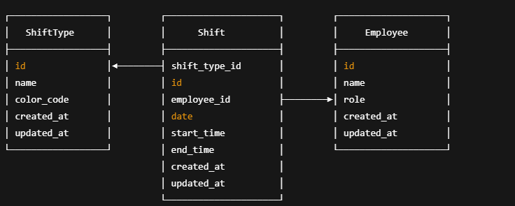

# Team Scheduler

A simple employee shift scheduling system with a Ruby on Rails API backend and a modern React (Next.js) frontend.

---

## Tech Stack

- **Backend**: Ruby on Rails 7 (API-only mode)
- **Database**: PostgreSQL
- **Frontend**: React (Next.js 14) with Tailwind CSS and shadcn/ui
- **Toast & Loading Feedback**: Sonner & Skeleton components
- **API Communication**: Axios

---

## Features

- CRUD for Employees, Shift Types, and Shifts
- Edit, delete, and add functionality with instant feedback
- Form validation, skeleton loaders, and toast notifications
- Clean UI built with `shadcn/ui` components
- Modular and well-structured component-based frontend

---

## Data Structure



## Getting Started (Backend)

```bash
cd backend
bundle install
rails db:create db:migrate db:seed
rails server
```
